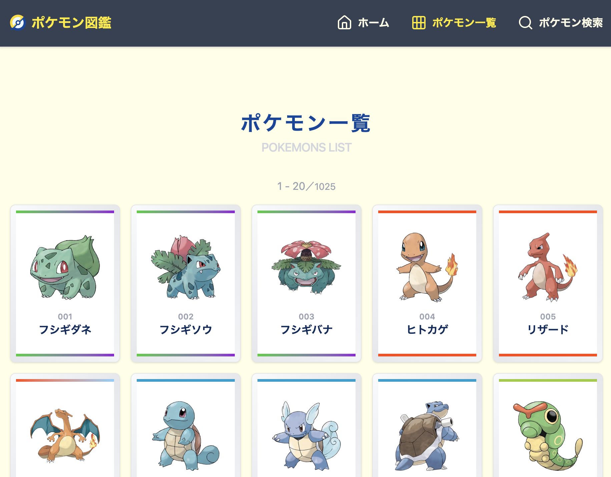
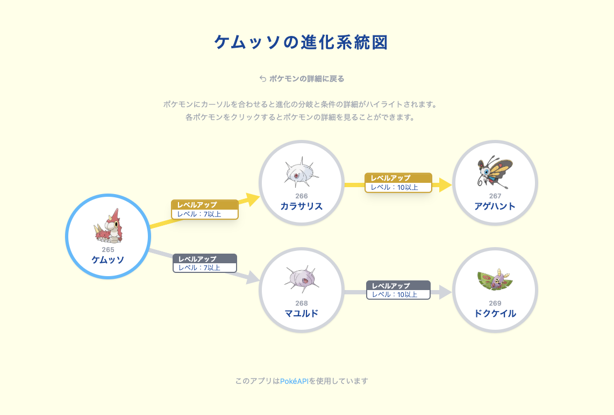
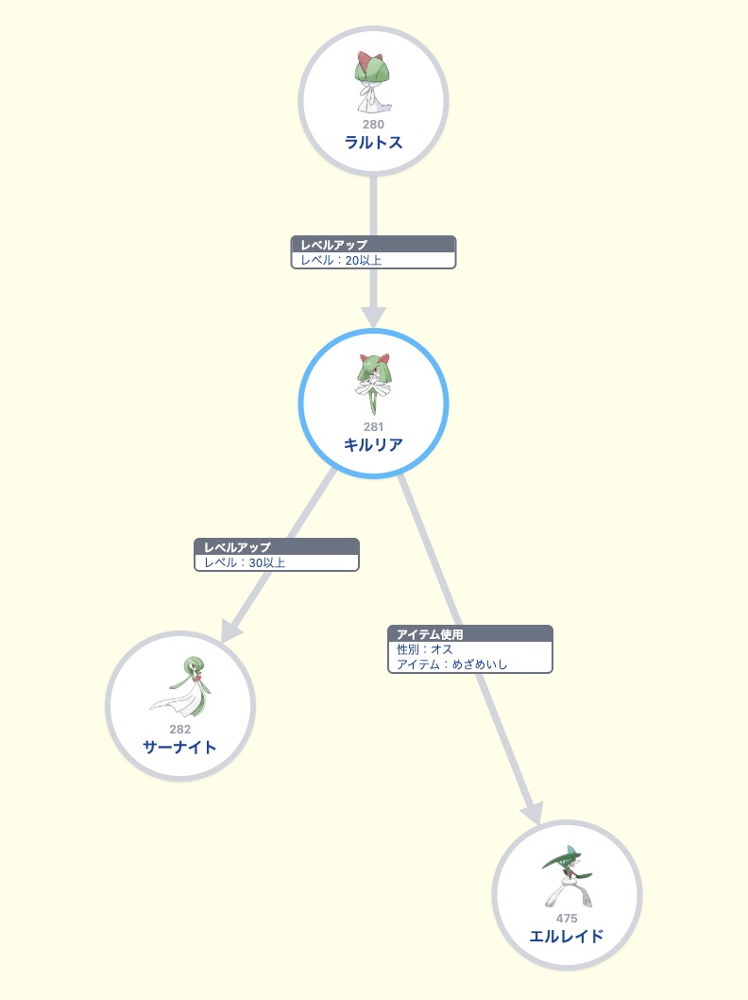
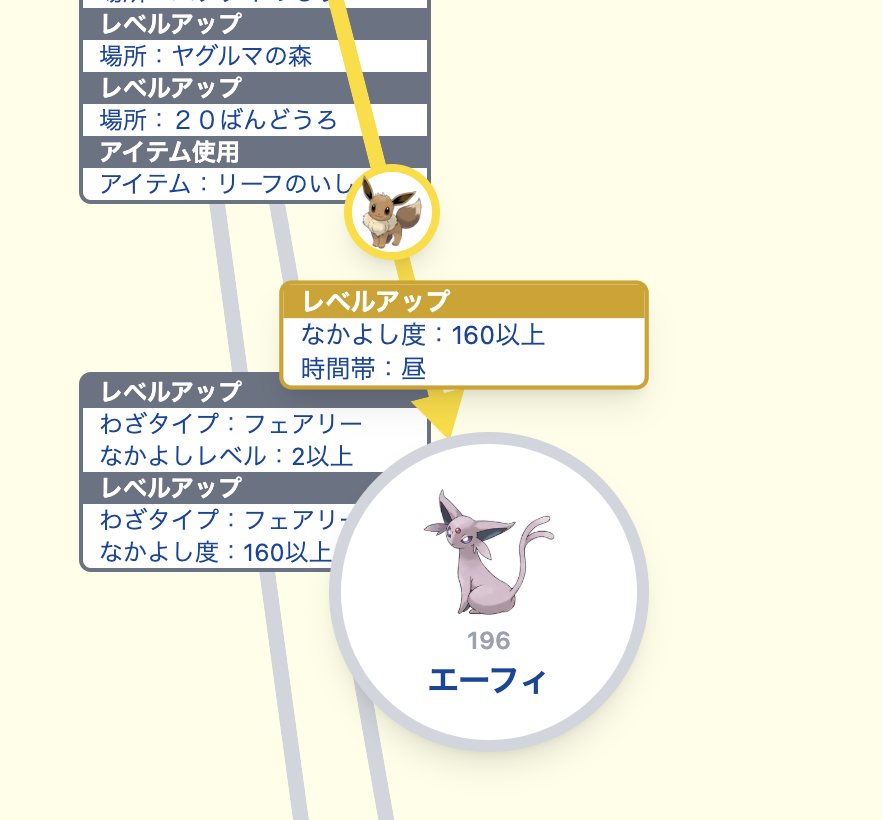

#  ポケモン図鑑

[Next.js](https://nextjs.org)、[TypeScipt](https://www.typescriptlang.org/)、[Tailwind CSS](https://tailwindcss.com/)、[shadcn/ui](https://ui.shadcn.com/)を使用して作成したポケモン図鑑アプリです。

https://pokedex-ev.vercel.app



## 使用方法

1. 依存関係をインストール

```bash
npm install
```

2. 開発サーバーを起動

```bash
npm run dev
```

3. [http://localhost:3000](http://localhost:3000)を開いて表示を確認してください。

4. プロダクションビルド

```bash
npm run build
npm start
```

## 技術スタック

- フレームワーク：Next.js 15 (App Router)
- 言語：TypeScript
- スタイリング：Tailwind CSS v4
- ui：shadcn/ui
- アイコン：Lucide React
- API：[PokéAPI](https://pokeapi.co/)

## 機能

### 主要機能

- ポケモン一覧 `/pokemon/`：全ポケモンを ID 順に 1 ページあたり 20 体表示
- ポケモン検索 `/search/`：全ポケモンから検索して結果を 1 ページあたり 10 体表示
- ポケモン詳細 `/pokemon/[id]/`：ポケモンの詳細情報を表示
  - ナビゲーション：前後のポケモンへのナビゲーション
- ポケモン進化系統図 `/evolution/[id]/`：/ポケモンの進化前/進化後のポケモン、進化に必要な条件をツリー状に表示

### 詳細

#### ポケモン一覧

- 1 ページあたり 20 体のポケモンを表示
- ページネーションは現在地に応じて左右を適切に省略

#### ポケモン検索

- 日本語（ひらがな・カタカナ）での部分一致検索
- 結果は 1 ページあたり 10 体表示
- ページネーションは現在地に応じて左右を適切に省略

#### ポケモン詳細

- No、名前（日本語優先）、分類、タイプ、高さ（m 表記）、重さ（kg 表記）、特性を表示
- 特性の説明（日本語優先、なければ「説明なし」）を表示
- 分類がない場合は「分類なし」と表示

#### ポケモン進化系統図

- 進化前/進化後のポケモンをツリー状に表示（横/縦の表示切り替え対応）
- 各進化に対応する進化条件（トリガーと条件の詳細）を表示
- ポケモンをホバー（タッチデバイスでは 1 タップ）するとそのポケモンへの進化系統をハイライト
- 進化元ポケモンがスクロールアウトした状態でハイライトすると進化元ポケモンと詳細を進化先の近くに引き寄せて表示



<div style="display:flex;justify-content:space-between;align-items:center;">


</div>

## ディレクトリ構成

```bash
src/
├── app/
│   ├── page.tsx              # ホームページ
│   ├── pokemon/
│   │   ├── page.tsx          # ポケモン一覧ページ
│   │   └── [id]/
│   │       └── page.tsx      # ポケモン詳細ページ
│   ├── search/
│   │   └── page.tsx          # 検索ページ
│   └── evolution/
│       └── [id]/
│           └── page.tsx      # ポケモン進化系統図ページ
├── components/
│   ├── atoms/                    # 最小要素
│   │   ├── Loading.tsx           # スピンローディング
│   │   ├── ToggleByIsTouch.tsx   # タッチデバイス判定により表示を切り替える
│   │   ├── ToList.tsx            # 一覧ページへ戻るボタン
│   │   └── TransitionLink.tsx    # 遷移アニメーションを起動するリンク
│   ├── layout/
│   │   ├── Header.tsx            # ヘッダーナビゲーション
│   │   └── Footer.tsx            # APIクレジット
│   ├── molecules/                # 機能的な意味を持つグループ
│   │   ├── EvolutionBranch.tsx   # 進化系統図の枝
│   │   ├── EvolutionNode.tsx     # 進化系統図のポケモン表示部分
│   │   ├── EvolutionTree.tsx     # 進化系統図の本体、再帰構造
│   │   └── PokemonCard.tsx       # 一覧や検索結果で表示するカード
│   ├── organisms/                # 機能的な意味を持つグループ
│   │   ├── Pagination.tsx        # ページネーション
│   │   └── SearchForm.tsx        # 検索フォーム
│   └── ui/                       # shadcn/uiコンポーネント
│   　   ├── badge.tsx
│   　   ├── button.tsx
│   　   ├── card.tsx
│   　   ├── input.tsx
│   　   └── pagination.tsx
├── hooks/
│   ├── useGetElementProperty.ts     # DOM要素のRect情報を取得
│   └── useWindowWidth.ts            # windowの幅を取得
├── lib/
│   ├── constants.ts        # 定数
│   ├── pokeapi.ts          # APIリクエスト関数
│   └── types.ts            # 型定義
└── utils/
    ├── Paginator.ts      # ページネーション情報クラス
    ├── utils.ts          # ユーティリティ関数
    └── Vector.ts         # 2次元ベクトルクラス
```

## クラス

### Paginator

`PaginationInfo`インターフェースはサーバーサイドで API から取得したページネーション情報をアプリようにまとめ、クライアントサイドに渡します。以下の情報を持ちます。

- `currentPage`：現在のページ
- `totalPages`：全アイテム数
- `perPage`：1 ページあたりのアイテム数

`Paginator`クラスはクライアントサイドで`PaginationInfo`を引き継ぎ、`PaginationInfo`が持つ情報から計算されるページ数などの各種情報や、ページネーション表示に関する各種判定を与えます。

`PaginationOmitter`クラスはクライアントサイドで`PaginationInfo`を引き継ぎ、現在ページを基準に指定した範囲（`range`）外のページネーションボタンを省略するための各種情報を与えます。左端や右端では「1 … 3」のような無意味な省略をしないよう判定します。

`range=1`（現在地の左右 1 ページ以外は省略）の場合の例

- `[1 2 3 4 5 6 7 8 9]` 現在地：`5` -> `[1 … 4 5 6 … 9]`
- `[1 2 3 4 5 6 7 8 9]` 現在地：`3` -> `[1 2 3 4 … 9]`
- `[1 2 3 4 5 6 7 8 9]` 現在地：`7` -> `[1 … 6 7 8 9]`

### Vector

`Vector`クラスは`(x,y)`の 2 次元ベクトル演算を与えます。絶対値や仰角などの情報と、内積・加法・減法・スカラ倍・正規化などの演算に対応しています。進化系統図ツリーの表示座標を計算するために使用します。
